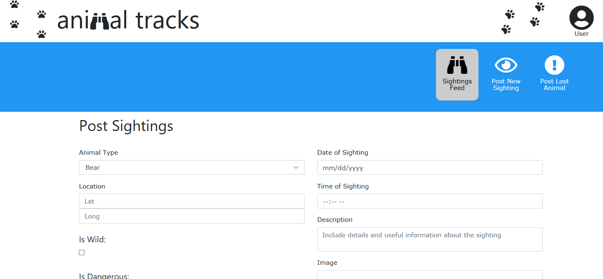

2019 Spring Cohert of the University of Minnesota Programming Bootcamp: Project 3

Team Lannister:

Brian Lynn - Back end / react-google-maps
Ivan Wijetunge - Project Manager
Simon Kinsler - Back end
Christopher Cannady - Front end
Mike Snyder - Back End
Laura Elias - Front End

This app can: 
help neighbors locate lost animals
notify others of potentially dangerous situations 
keep a record of locations of wildlife issues
keep data that can help animal control authorities

How it works: 
users can submit an animal sighting, and include information such as type of animal, location, and other relevant details
posts are displayed on a news-feed style interface
data is stored in a database
users can look up previous posts along various parameters

Project 3: Requirements 
Must use React, Vue, or Angular in some way (even if minimal)
Must use a Node and Express Web Server
Must be backed by a MySQL or MongoDB Database with a Sequelize or Mongoose ORM
Must have both GET and POST routes for retrieving and adding new data
Must be deployed using Heroku (with Data)
Must utilize at least two libraries, packages, or technologies that we haven’t discussed
Must have a polished frontend / UI
Must have folder structure that meets MVC Paradigm
Must meet good quality coding standards (indentation, scoping, naming)
Must not expose sensitive API key information on the server, see Protecting-API-Keys-In-Node.md
Optional tools

Deployed Heroku Application
Deployed Heroku Link: https://project3animaltracks.herokuapp.com/
Deployed GitHub Link: https://github.com/iwijetunge/project3

